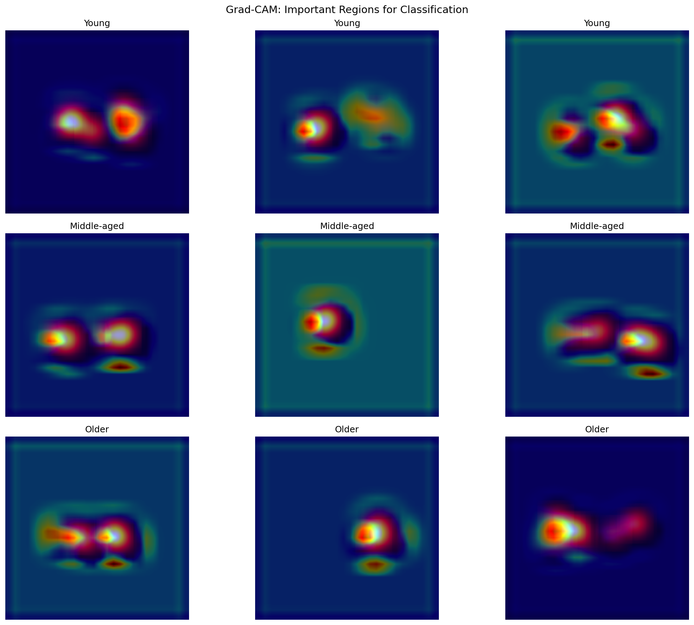
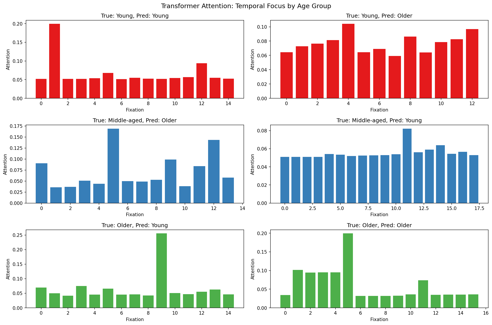
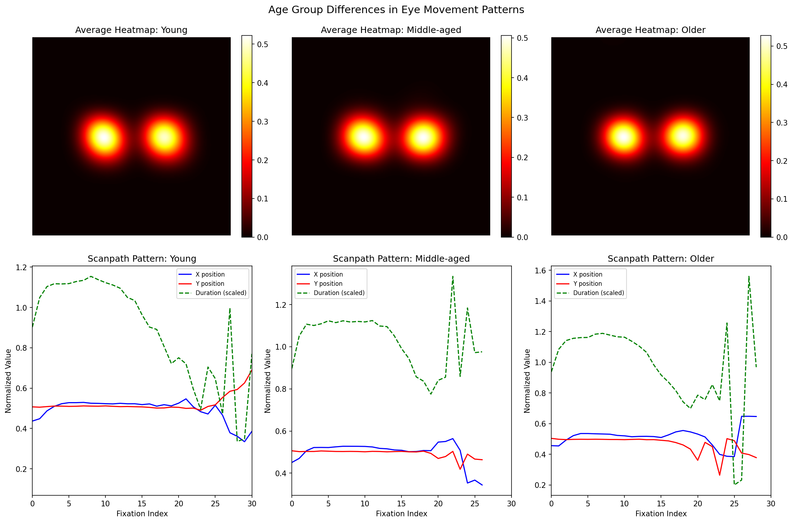

# Deep Learning Explainability Report

## 1. Grad-CAM Visualizations (CNN)

Grad-CAM highlights the regions of the heatmap that most influence the CNN's classification decision.

**Interpretation**: Brighter regions in the overlay indicate areas the model focuses on for age group classification.

## 2. Attention Patterns (Transformer)

The attention weights show which fixations the Transformer model considers most important.

**Interpretation**: Higher attention weights indicate temporally important fixations for classification.

## 3. Class Differences Analysis

Average eye movement patterns across age groups:

### Key Observations:

- **Spatial Distribution**: Average heatmaps reveal different exploration patterns
- **Temporal Dynamics**: Scanpath trajectories show age-related differences in:
  - Initial fixation patterns (early vs late attention)
  - Fixation duration profiles
  - Spatial exploration extent

## 4. Feature Summary

See `class_analysis.json` for detailed statistics per age group.

---
*Generated automatically by explainability.py*
